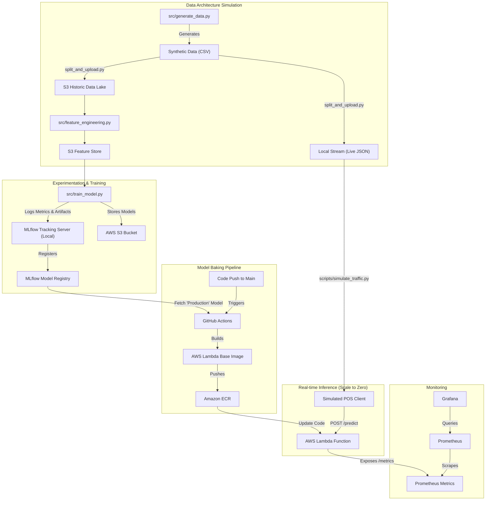

# Retail Anomaly Detection & Cashier Integrity System (Production MLOps)

## Overview
This project implements a **Production-Grade MLOps Pipeline** for retail fraud detection. It features a dual-model architecture (XGBoost + Isolation Forest) deployed via a fully automated CI/CD pipeline.

## Architecture Patterns
- **Control Plane**: MLflow Tracking Server on EC2 (S3 Artifact Store).
- **Model Baking**: GitHub Actions builds Docker images with the *exact* model artifacts from MLflow.
- **Serving Plane**: Serverless FastAPI on AWS Lambda (via Mangum adapter).
- **Monitoring Plane**: Prometheus & Grafana for metric observability (Sidecar pattern).

## End-to-End MLOps Architecture


## Directory Structure
```
.
├── .github/workflows/    # CI/CD Workflows
│   └── deploy.yml        # "Model Baking" Pipeline
├── app/                  # REST API Service
│   ├── main.py           # FastAPI Inference Service
│   ├── Dockerfile        # Container Definition
│   ├── requirements.txt  # Dependencies
│   └── *.joblib          # Artifacts for deployment
├── data/                 # Data Assets
│   └── *.csv             # Synthetic Data & Features
├── ecs/                  # AWS ECS Configuration
│   └── task-definition.json
├── monitoring/           # Observability Stack
│   ├── docker-compose.yml
│   └── prometheus.yml
├── plots/                # Evaluation Metrics Visuals
├── scripts/              # Infrastructure Scripts
│   └── setup_mlflow.sh
├── src/                  # Source Code
│   ├── train_model.py
│   ├── feature_engineering.py
│   └── generate_data.py
```

## Setup Instructions

### 1. The Control Plane (MLflow)
We use a dedicated EC2 instance for the Tracking Server.

1.  **Launch EC2**: Ubuntu 22.04 `t3.medium`.
2.  **Create S3 Bucket**: `my-retail-fraud-artifacts`.
3.  **Run Setup**:
    ```bash
    scp -i key.pem setup_mlflow.sh ubuntu@<EC2_IP>:~
    ssh -i key.pem ubuntu@<EC2_IP>
    chmod +x setup_mlflow.sh
    ./setup_mlflow.sh s3://my-retail-fraud-artifacts
    ```
    *This installs MLflow as a systemd service for durability.*

### 2. The Model Registry
Train and register your first model version:
1.  Configure `train_model.py` to point to your new MLflow server (modify URI).
2.  Run `python train_model.py`.
3.  In MLflow UI, transition the best model version to stage **"Production"**.

### 2. Serving Plane (AWS Lambda)
- [ ] **S3 & ECR Creation**: Run `scripts/setup_aws_infra.sh` to create `retail-fraud-artifacts` and the `retail-fraud-detection` ECR repository.
- [ ] **IAM Role**: The script also creates `RetailFraudLambdaRole` for Lambda execution.
- [ ] **Lambda Deploy**: The GitHub Actions pipeline will automatically deploy the ECR Image to AWS Lambda.

### 3. CI/CD Pipeline (GitHub)
- [ ] **Secrets**: Configure Repository Secrets:
    - `AWS_ACCESS_KEY_ID`, `AWS_SECRET_ACCESS_KEY`
    - `AWS_ACCOUNT_ID` (For task def ARN construction)
    - `MLFLOW_TRACKING_URI`
- [ ] **Trigger**: Push/Merge to `main` branch to trigger deployment.

### 4. The Monitoring Plane
Deploy observability alongside the app:
```bash
cd monitoring
docker-compose up -d
```
- **Prometheus**: `:9090` (Scrapes `app:8000/metrics`)
- **Grafana**: `:3000` (Default login: `admin` / `admin`)
    1.  Login to Grafana.
    2.  Go to **Dashboards** -> **New** -> **Import**.
    3.  Upload `monitoring/grafana_dashboard.json`.
    4.  Select "Prometheus" as the data source.
    
**Dashboard Panels**:
- **Throughput**: Real-time Requests Per Second (RPS).
- **Latency**: P95 Response Time (Target < 100ms).
- **Business Logic**: Pie chart of Fraud Predictions (High/Medium/Low Risk).
- **Model Health**: Heatmap of Risk Score distribution.

## API Reference
**POST /v1/predict**
```json
{
  "transaction_id": "T100",
  "cashier_id": "C001",
  "item_count": 12,
  "total_amount": 150.00,
  "void_count": 0,
  "no_sale_count": 0,
  "weight_variance": 0.1
}
```
**Response**:
```json
{
  "transaction_id": "T100",
  "risk_score": 12.5,
  "risk_level": "Low Risk",
  "action": "Log only",
  "latency_ms": 45.2
}
```
